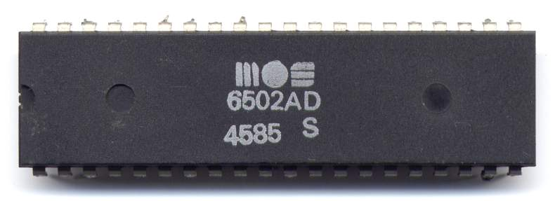

# Introduction 6502 Emulator With Javascript

Learning how a CPU works by emulating one.

All with unit test :P

# Feature

- [x] LDA_INST_IM - Load Accumulator Immediate

- [x] LDA_INST_ZP - Load Accumulator Zero Page

- [ ] LDA_INST_ZPX - Load Accumulator Zero Page X

- [ ] LDA_INST_ABS - Load Accumulator Absolute

- [ ] LDA_INST_ABSX - Load Accumulator Absolute X

- [ ] LDA_INST_ABSY - Load Accumulator Absolute Y

- [ ] LDA_INST_INDX - Load Accumulator Indirect X

- [ ] LDA_INST_INDY - Load Accumulator Indirect Y

- [ ] LDX_INST_IM - Load X Immediate

- [ ] LDX_INST_ZP - Load X Zero Page

- [ ] LDX_INST_ZPY - Load X Zero Page Y

# References 

https://pt.wikipedia.org/wiki/6502

https://github.com/davepoo/6502Emulator

https://www.youtube.com/watch?v=qJgsuQoy9bc&t=131

https://www.youtube.com/watch?v=7WuRq-Wmw5o